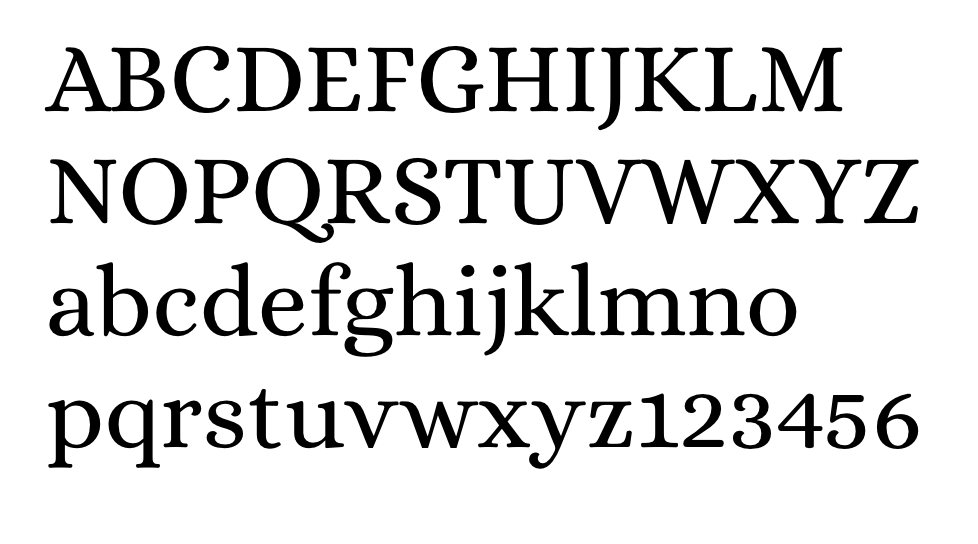
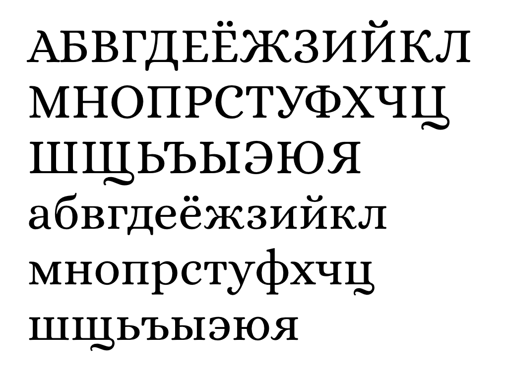

# Alice Font

Open-source font by Ksenia Erulevich

Ksenia Erulevich, designer of Alice typeface,
was inspired by Lewis Carroll's novel and
decided to make a typeface that will
be suitable for typesetting this book.

It came out eclectic and quaint, old-fashioned, 
having widened proportions, open aperture, and 
soft rounded features. Perfect for long meditative text-setting and headlines.

Alice is Ksenia's first typeface, as part of 
her diploma project at the Type & Typography course in Moscow, Russia.

Released by Cyreal with help from Gayaneh Bagdasaryan and Alexei Vanyashin.

### Copyright

Copyright 2011 The Alice Project Authors (contact@cyreal.org) with Reserved Font Name "Alice"

### License

This Font Software is licensed under the SIL Open Font License, Version 1.1. This license is available with a FAQ at: [http://scripts.sil.org/OFL][1]

### Links

 * [Alice on Google Fonts][2]
 * [Alice on Cyreal][3]

[1]: http://scripts.sil.org/OFL
[2]: https://fonts.google.com/specimen/Alice
[3]: http://cyreal.org/fonts/alice/

